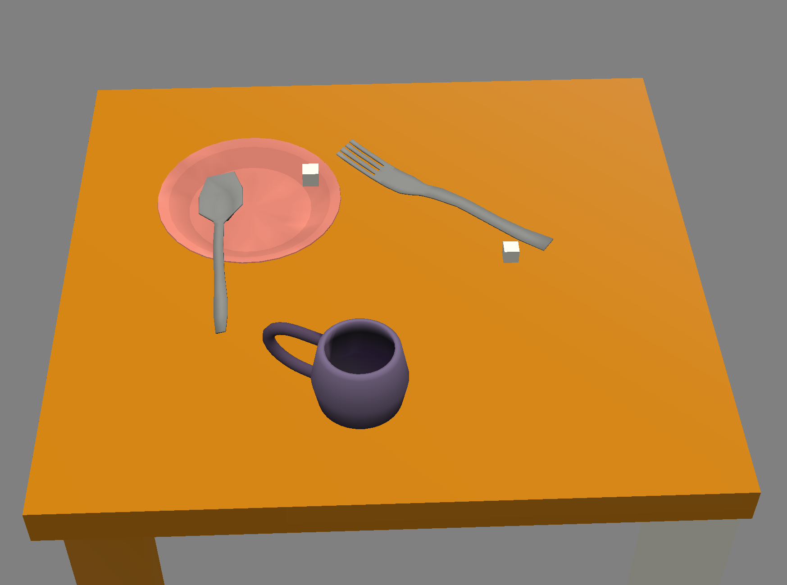

# Coffee Conundrum

Author: George Whitfield (gwhitfie)

Design: You are an amature home cook and you try to make your own coffee. 
But you need to add tons sugar to mask the taste because you actually hate coffee.

Screen Shot:

How Your Asset Pipeline Works:

1) Scenes built in blender
2) Texture colors, positions, rotations, stored in mesh data
3) Blender scene exported to .pnct file
4) .pnct imported into game, converted into data to be used in game

How To Play:

Press the A key to move the mug left, D to move the mug right.

Collect 25 sugar cubes to win.

The score is displayed in the top left corner of the screen.

Use the mouse to move the mug around for fun!

This game was built with [NEST](NEST.md).

